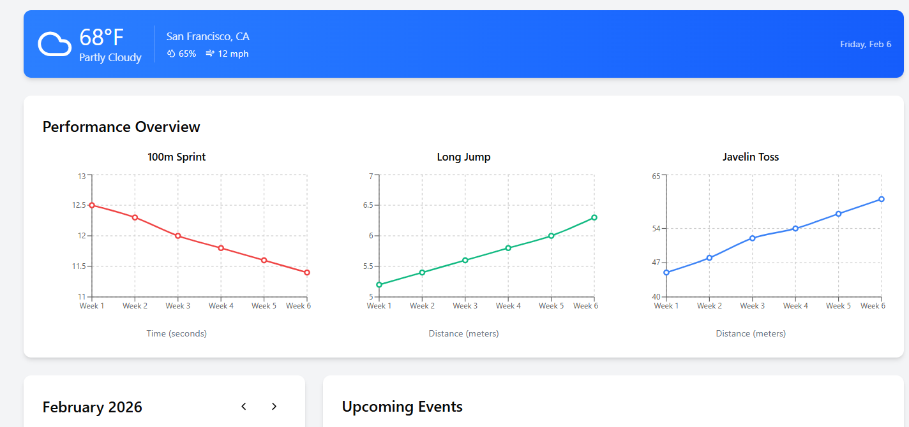
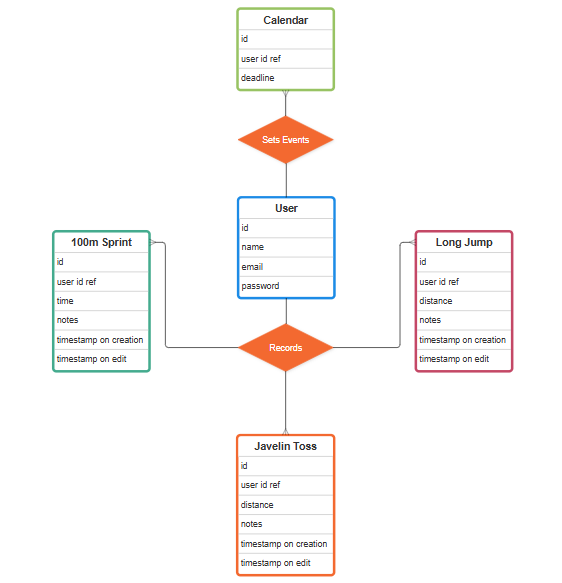

# Track & Field Widget

### Capstone MERN full stack project proudly showcasing all that we have learned at Per Scholas

## Description
A simple web app for athletes to keep track of their track and field stats

## Table of Contents
* [Technologies Used](#technologiesused)
* [Features](#features)
* [Design](#design)
* [Deployed App](#deployment)
* [About the Author](#author)
* [Reflection](#reflection)

## Technologies Used
* NodeJS to use Node Package Manager and to import node modules
* React framework for frontend development
* React Router to facilitate linking page components
* Vite to help build React projects
* Axios for simplified API CRUD operations
* Material UI (MUI) for stylization (CSS equivalent)
* A whole separate backend I built to make API calls with my database
* ExpressJS for server routing and for controlling requests and responses
* MongoDB as the NoSQL database
* Mongoose as the Object Data Modeling library to help with writing to MongoDB
* BCrypt library for password encryption
* JSON Web Token library to work with JWTs for user account system
* Git and GitHub for version control system and code repository
* Postman to test API routes
* Netlify as the publishing platform as well as helping with CI/CD combined with GitHub
* Figma for a bit of wireframing
* [Open-Meteo](https://open-meteo.com/) for a simple weather API

## Features
* User account creation and login
* Create, edit, and delete track and field stats
* Create, edit, and delete upcoming dates for events
* Customize which events a user is part of
* Visual graph to represent progress in your activities
* Current temperature and weather display
* Light/Dark theme switch

## Design
### Figma

### Entity Relationship Diagram

### Project Milestones and Deadlines

## Deployed Link
* [Netlify](https://boisterous-bonbon-56ae0e.netlify.app/)

* [Frontend Github Repository](https://github.com/jimenezkgabriel/track-and-field-app-frontend)

* [Backend Github Repository](https://github.com/jimenezkgabriel/track-and-field-app-backend)

## About The Author
Per Scholas student just trying to learn the foundations of the MERN stack. Bottom text.
    
## Works Cited:
* [React Docs](https://react.dev/learn)
* [Material UI Docs](https://mui.com/material-ui/all-components/)
* [MongoDB Docs](https://www.mongodb.com/docs/)
* [Mongoose Library Docs](https://mongoosejs.com/docs/)
* [Netlify Docs](https://docs.netlify.com/)
* [Open-Meteo](https://open-meteo.com/)

## Reflection
Development Process:
* The culmination of several months in learning the basics and advanced topics of full stack web development. Combining React frontend development with ExpressJS + MongoDB backend development. This project mimics an abridged version of a complete project development lifecycle, starting with drafting a project outline artifact which defines project purpose, project scope, software requirements, wireframe artifacts, project management and milestones. We were to draft a Entity-Relationship diagram to architect database data structure. For project timeline, I decided to go with a Gantt Chart, courtesy of my tenure as a Software Engineer undergrad. The project required to separate the backend from the frontend and house them in two separate GitHub Repositories so there was a process of bridging the two in a production environment. I used whatever I've learned to setup RESTful APIs in the backend. I strive to keep my code clean and readable and found myself refactoring code a lot as I kept asking myself: "There has to be a better way to do this" Either better or more engineered aligned such as separation of concerns and resusability. There are a few more features I had envisioned but had to leave out the implementation due to time constraints. I can imagine myself continuing to work on this app, eventually adding cut features or refactoring code to be even more elegant.

Challenges faced:
* The biggest challenge I can recall on working on this project was simply setting up Netlify as the deployment platform for both the backend and the frontend and figuring out how they talk to each other. It may be simple calling the Netlify.app domain with api routes, but now the second challenge was taming the CORS error; with the added complexity of working the CORS problem in two environments: dev environment and production environment. Another challenge I have been facing for the past React projects is getting more familiar with Material UI components for stylization; especially with their ThemProvider, which I only used to customize the default colors when switching between the built in light and dark modes... Which was surprisingly intuitive to use.

Solutions implemented:
* To combat the CORS issue, I had to set up configuration on Netlify and Vite config files and include a proxy to bypass CORS error. I had to do this for the two aforementioned environments. It was bit of a headache to find out Netlify runs off it's own node package rather than Expressjs. For figuring out ThemeProvider from MUI, just lots of research. The exact solution was to build a ThemeContext or Object and provide the right key-value pair that I wanted. There was not a lot I wanted to override and the solution was very simple to implement.

Potential improvements:
* Given more time, I would have implemented some pagination or scroll bar feature to the list of track and field stats, a filtering feature, the ability to set some user settings such as switching from meters to feet and have those converted appropriately, color customization. Late into development, I noticed I could have improved reusability by tweaking the backend and DB structure so it can fit the frontend and create a really nice refactor where I didn't have to repeat the same structure of code, this also makes it scalable.